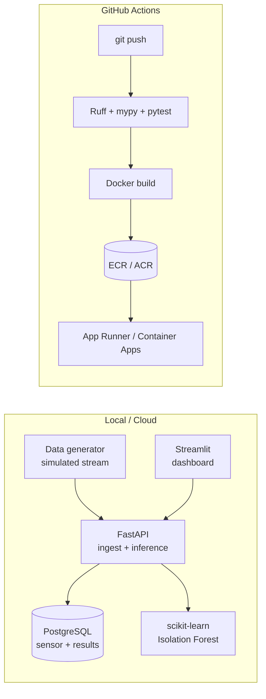

# factory-sensor-anomaly

> Real-time anomaly detection platform for factory sensor streams — pressure, temperature, RPM, vibration. End-to-end: live ingest → Postgres → unsupervised model → Streamlit dashboard → cloud.

[](https://github.com/eastani/factory-sensor-anomaly/actions/workflows/ci.yml)
[](pyproject.toml)
[](https://github.com/astral-sh/ruff)
[](LICENSE)

> **Companion repo:** [eastani/predictive-maintenance-cmapss](https://github.com/eastani/predictive-maintenance-cmapss) benchmarks **supervised RUL regression** on batch CMAPSS turbofan data. **This** repo operationalises the other half of the IIoT problem: **unsupervised anomaly detection on a live stream**, with persistence, a dashboard, and cloud deploy. The two are designed to be read as a pair.

## Why this project

Real factories don't get clean failure labels handed to them. Pumps, compressors, and motors emit pressure / temperature / RPM / vibration streams, and operators need to know **right now** when something is drifting — before a label or a failure exists. Threshold alarms are noisy; supervised models need labelled failures that take months or years to collect.

This project demonstrates an **unsupervised, streaming anomaly detection pipeline** running end-to-end with real public datasets and a production-shaped architecture (containerised, persisted, dashboarded, CI/CD'd, cloud-deployed).

The goal is not novel ML. The goal is to show that the author can take an unsupervised model from a notebook to a **live, observable, reproducible service** that another engineer could pick up and extend.

## Architecture



## Phased plan

| Phase | Theme | Status |
|-------|-------|--------|
| -1 | Domain & dataset selection (ADRs) | ✅ done |
| 0  | Quality baseline (uv, Ruff, mypy, pytest, pre-commit) | ✅ done |
| 1  | MVP — Postgres + FastAPI + Streamlit on docker-compose | ✅ done |
| 1.6 | MLOps polish — /metrics, model card, drift primitives, SKAB eval | ✅ done |
| 2  | IaC (Terraform) + CI/CD + cloud deploy (AWS or Azure) | 📋 planned |
| 3  | Image-based anomaly microservice (PyTorch + async queue) | 📋 planned |
| 4  | Demo polish (README GIF, live URL, architecture diagram) | 📋 planned |

See [`docs/adr/`](docs/adr/) for architectural decisions, [`docs/model-cards/baseline.md`](docs/model-cards/baseline.md) for the live model card, and [`docs/evaluation/baseline-skab.md`](docs/evaluation/baseline-skab.md) for the honest evaluation on real SKAB data.

## Quickstart

### Run the full stack (recommended)

```bash
# Brings up db + api + dashboard + ingester + scorer.
docker compose up -d --build

# Open the dashboard at http://localhost:8501
# OpenAPI/Swagger at http://localhost:8000/docs
# Watch the inference loop run:
docker compose logs -f scorer
```

What you get:

| Service | URL | What it does |
|---------|-----|--------------|
| `dashboard` | http://localhost:8501 | Streamlit UI — sensor chart + anomaly markers + score history |
| `api` | http://localhost:8000 | FastAPI; `/healthz`, `/ingest`, `/infer`, `/readings`, `/anomalies` |
| `db` | localhost:5432 | Postgres 16 with the Alembic schema applied |
| `ingester` | — | Posts a fresh synthetic batch to `/ingest` every 10s (see [ADR-0004](docs/adr/0004-inference-trigger-final.md)) |
| `scorer` | — | Calls `/infer` every 5s, persisting anomaly results |

### Run quality gates locally

```bash
brew install uv                 # macOS; see https://docs.astral.sh/uv/
make install
make pre-commit-install
make check                      # lint + typecheck + test
```

## Repository layout

```
.
├── docs/
│   └── adr/                  # Architecture Decision Records
├── src/factory_anomaly/      # Library code (importable as `factory_anomaly`)
├── tests/                    # pytest suite
├── data/                     # gitignored — datasets land here locally
├── pyproject.toml            # single source of truth for tooling config
├── Makefile                  # task runner — `make help` for targets
├── .pre-commit-config.yaml   # git hooks: ruff, gitleaks, basic hygiene
└── .env.example              # template for local secrets
```

## Data

This project uses publicly available industrial sensor datasets. See [ADR-0001](docs/adr/0001-domain-and-dataset.md) for selection rationale.

- **Primary:** [Kaggle Pump Sensor Data](https://www.kaggle.com/datasets/nphantawee/pump-sensor-data) — 52-channel pump telemetry with `NORMAL` / `BROKEN` / `RECOVERING` labels.
- **Secondary:** [SKAB — Skoltech Anomaly Benchmark](https://github.com/waico/SKAB) — multi-sensor industrial water-circulation testbed with anomaly intervals labelled by domain experts. Public on GitHub, no registration friction, ideal for CI fixtures.

Raw datasets are never committed; `data/` is gitignored.

## Prior art surveyed

Before writing a line of code, similar projects were studied to identify what to learn and how to differentiate. Full notes in [ADR-0001](docs/adr/0001-domain-and-dataset.md).

| Repo | What to learn | How this project differs |
|------|---------------|--------------------------|
| [vishwasg217/Predictive-Maintenance](https://github.com/vishwasg217/Predictive-Maintenance) | docker-compose layout for FastAPI + Streamlit | Adds Postgres persistence, CI/CD, ADR trail |
| [DeepKnowledge1/industrial_anodet_mlops](https://github.com/DeepKnowledge1/industrial_anodet_mlops) | ONNX export, Azure ML/AKS deploy | Tabular time-series instead of images (Phase 3 catches up) |
| [dpleus/mlops](https://github.com/dpleus/mlops) | Prometheus + Grafana on FastAPI | Anomaly-specific scoring + Postgres event log |
| [Sa1f27/predictive-maintenance-mlops](https://github.com/Sa1f27/predictive-maintenance-mlops) | Drift detection, GitHub Actions matrix | Stronger ADR/observability story |
| [Jacer7/Anomaly_Detection](https://github.com/Jacer7/Anomaly_Detection) | STL decomposition + Isolation Forest combo | Adopted — see ADR-0002 |

## License

MIT — see [LICENSE](LICENSE).
