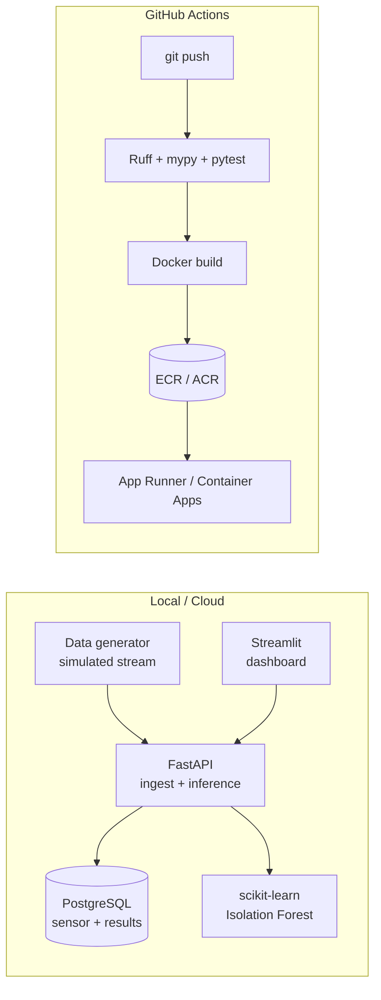

# factory-sensor-anomaly

> End-to-end anomaly detection service for factory sensor time-series — pressure, temperature, RPM, vibration. Built as a portfolio project demonstrating MLOps fundamentals on AWS / Azure.

[](https://github.com/eastani/factory-sensor-anomaly/actions/workflows/ci.yml)
[](pyproject.toml)
[](https://github.com/astral-sh/ruff)
[](LICENSE)

## Why this project

Industrial machinery — pumps, compressors, motors — emits time-series signals (pressure, temperature, RPM, vibration). Operators want to know **before** something breaks. Classic threshold alarms are noisy; supervised models need failure labels that are expensive to collect. This project demonstrates an **unsupervised anomaly detection pipeline** running end-to-end with a real public dataset and a production-shaped architecture (containerised, CI/CD, cloud-deployed).

The goal is not novel ML. The goal is to show that the author can take a model from a notebook to a live, observable, reproducible service.

## Architecture



## Phased plan

| Phase | Theme | Status |
|-------|-------|--------|
| -1 | Domain & dataset selection (ADRs) | ✅ done |
| 0  | Quality baseline (uv, Ruff, mypy, pytest, pre-commit) | ✅ done |
| 1  | MVP — Postgres + FastAPI + Streamlit on docker-compose | ⏳ next |
| 1.5 | Observability + MLOps basics (structured logs, model versioning) | 📋 planned |
| 2  | IaC (Terraform) + CI/CD + cloud deploy (AWS or Azure) | 📋 planned |
| 3  | Image-based anomaly microservice (PyTorch + async queue) | 📋 planned |
| 4  | Demo polish (README GIF, live URL, architecture diagram) | 📋 planned |

See [`docs/adr/`](docs/adr/) for architectural decisions.

## Quickstart

```bash
# 1. Install uv (https://docs.astral.sh/uv/)
brew install uv         # macOS

# 2. Bootstrap the dev environment
make install
make pre-commit-install

# 3. Run quality gates
make check              # lint + typecheck + test
```

## Repository layout

```
.
├── docs/
│   └── adr/                  # Architecture Decision Records
├── src/factory_anomaly/      # Library code (importable as `factory_anomaly`)
├── tests/                    # pytest suite
├── data/                     # gitignored — datasets land here locally
├── pyproject.toml            # single source of truth for tooling config
├── Makefile                  # task runner — `make help` for targets
├── .pre-commit-config.yaml   # git hooks: ruff, gitleaks, basic hygiene
└── .env.example              # template for local secrets
```

## Data

This project uses publicly available industrial sensor datasets. See [ADR-0001](docs/adr/0001-domain-and-dataset.md) for selection rationale.

- **Primary:** [Kaggle Pump Sensor Data](https://www.kaggle.com/datasets/nphantawee/pump-sensor-data) — 52-channel pump telemetry with `NORMAL` / `BROKEN` / `RECOVERING` labels.
- **Secondary:** [NASA IMS Bearings](https://data.nasa.gov/dataset/ims-bearings) — vibration run-to-failure for RPM/spectral features.

Raw datasets are never committed; `data/` is gitignored.

## Prior art surveyed

Before writing a line of code, similar projects were studied to identify what to learn and how to differentiate. Full notes in [ADR-0001](docs/adr/0001-domain-and-dataset.md).

| Repo | What to learn | How this project differs |
|------|---------------|--------------------------|
| [vishwasg217/Predictive-Maintenance](https://github.com/vishwasg217/Predictive-Maintenance) | docker-compose layout for FastAPI + Streamlit | Adds Postgres persistence, CI/CD, ADR trail |
| [DeepKnowledge1/industrial_anodet_mlops](https://github.com/DeepKnowledge1/industrial_anodet_mlops) | ONNX export, Azure ML/AKS deploy | Tabular time-series instead of images (Phase 3 catches up) |
| [dpleus/mlops](https://github.com/dpleus/mlops) | Prometheus + Grafana on FastAPI | Anomaly-specific scoring + Postgres event log |
| [Sa1f27/predictive-maintenance-mlops](https://github.com/Sa1f27/predictive-maintenance-mlops) | Drift detection, GitHub Actions matrix | Stronger ADR/observability story |
| [Jacer7/Anomaly_Detection](https://github.com/Jacer7/Anomaly_Detection) | STL decomposition + Isolation Forest combo | Adopted — see ADR-0002 |

## License

MIT — see [LICENSE](LICENSE).
