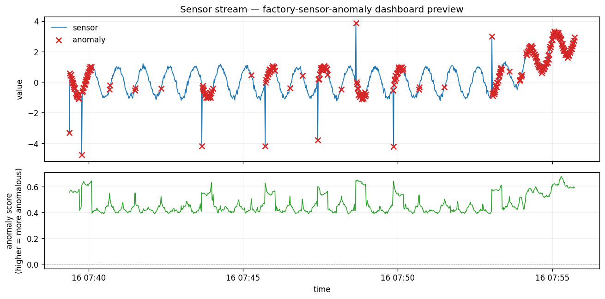
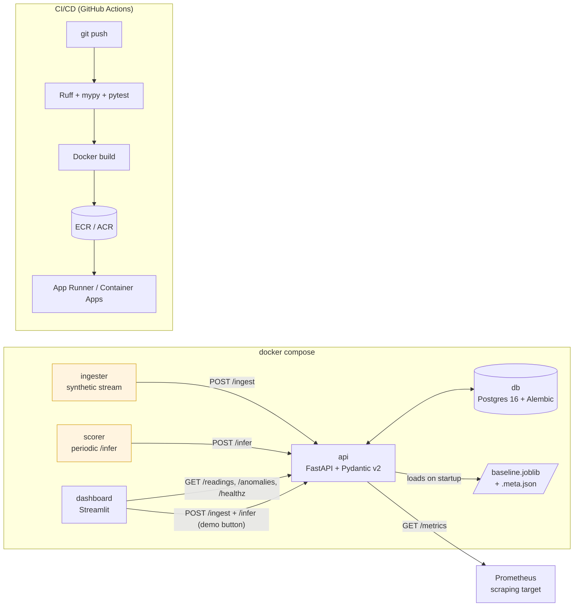
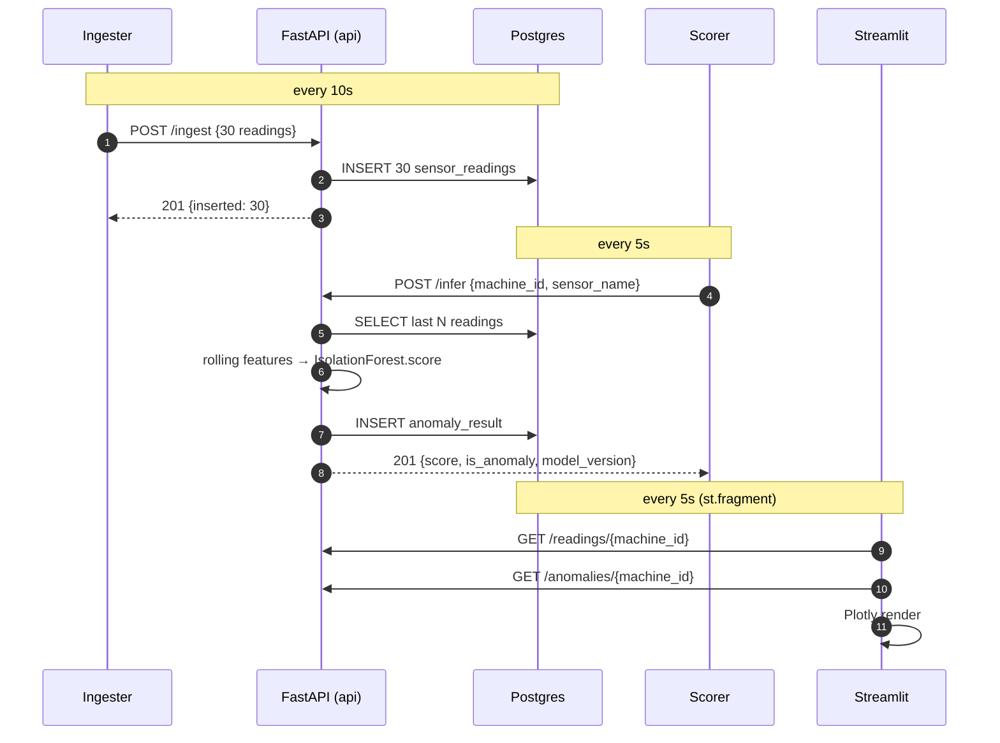

# factory-sensor-anomaly

> Real-time anomaly detection platform for factory sensor streams — pressure, temperature, RPM, vibration. End-to-end: live ingest → Postgres → unsupervised model → Streamlit dashboard → Prometheus metrics → cloud.

[](https://github.com/eastani/factory-sensor-anomaly/actions/workflows/ci.yml)
[](pyproject.toml)
[](https://github.com/astral-sh/ruff)
[](LICENSE)

> **Companion repo:** [eastani/predictive-maintenance-cmapss](https://github.com/eastani/predictive-maintenance-cmapss) benchmarks **supervised RUL regression** on batch CMAPSS turbofan data. **This** repo operationalises the other half of the IIoT problem: **unsupervised anomaly detection on a live stream**, with persistence, a dashboard, observability, and cloud deploy. The two are designed to be read as a pair.



*Rendered from the same synthetic data the live dashboard ingests. Re-run `make demo-preview` to regenerate. Red ✕ marks where the baseline Isolation Forest flags an anomaly — note how it over-flags cyclic peaks, which is exactly the limitation the [model card](docs/model-cards/baseline.md) records and Phase 1.7 will fix with STL residual scoring.*

---

## Table of contents

- [Project highlights](#project-highlights)
- [Why this project](#why-this-project)
- [Architecture](#architecture)
- [Inference flow](#inference-flow)
- [Phased plan](#phased-plan)
- [Quickstart](#quickstart)
- [Repository tour](#repository-tour)
- [Data](#data)
- [Prior art surveyed](#prior-art-surveyed)
- [License](#license)

## Project highlights

| Area | What is in place |
|------|------------------|
| **Engineering** | Python 3.12 / uv / Ruff (lint + format) / mypy strict / pytest with 95% coverage / pre-commit (gitleaks + ruff) / GitHub Actions CI |
| **Data** | Long-format Postgres schema agnostic to per-dataset sensor count; Alembic migrations from day one |
| **ML** | Isolation Forest with `joblib`-versioned artifacts + sha256 training-data hash + sklearn-version load gate |
| **Service** | FastAPI with lifespan model loading, Pydantic v2 schemas, JSON structured logs (structlog), Annotated dependency style |
| **UI** | Streamlit dashboard using `st.fragment(run_every=...)` for partial refresh, decoupled API client for testability |
| **Stack** | 5-service docker-compose (db + api + dashboard + ingester + scorer); single multi-stage image; non-root user |
| **Observability** | `/metrics` Prometheus endpoint with label-cardinality budgeted counters + histograms |
| **Honesty** | Real-data evaluation on SKAB ([report](docs/evaluation/baseline-skab.md)) — pipeline works, baseline model under-performs, Phase 1.7 upgrades scheduled |
| **Docs** | 4 ADRs documenting non-obvious decisions; auto-generated model card; bilingual JP/EN commit messages |

## Why this project

Real factories don't get clean failure labels handed to them. Pumps, compressors, and motors emit pressure / temperature / RPM / vibration streams, and operators need to know **right now** when something is drifting — before a label or a failure exists. Threshold alarms are noisy; supervised models need labelled failures that take months or years to collect.

This project demonstrates an **unsupervised, streaming anomaly detection pipeline** running end-to-end with real public datasets and a production-shaped architecture (containerised, persisted, dashboarded, observable, CI/CD'd, cloud-deployable).

The goal is not novel ML. The goal is to show that the author can take an unsupervised model from a notebook to a **live, observable, reproducible service** that another engineer could pick up and extend.

## Architecture



Decisions worth knowing about live in [`docs/adr/`](docs/adr/):

| # | Title | Status |
|---|-------|--------|
| [0001](docs/adr/0001-domain-and-dataset.md) | Domain selection & primary dataset | Accepted |
| [0002](docs/adr/0002-tech-stack.md) | Core tech stack & ML approach | Accepted |
| [0003](docs/adr/0003-inference-trigger.md) | Inference trigger (provisional) | Superseded by 0004 |
| [0004](docs/adr/0004-inference-trigger-final.md) | Inference trigger — final decision (ingester + scorer sidecars) | Accepted |

## Inference flow



## Phased plan

| Phase | Theme | Status |
|-------|-------|--------|
| -1 | Domain & dataset selection (ADRs) | ✅ done |
| 0  | Quality baseline (uv, Ruff, mypy, pytest, pre-commit) | ✅ done |
| 1  | MVP — Postgres + FastAPI + Streamlit on docker-compose | ✅ done |
| 1.6 | MLOps polish — /metrics, model card, drift primitives, SKAB eval | ✅ done |
| 1.7 | Multi-channel features + STL residual scoring (closes ADR-0002) | 📋 planned |
| 2A | IaC (Terraform) + OIDC-only CI/CD + AWS App Runner deploy | ✅ **deployed and verified end-to-end** — see [docs/evaluation/live-aws/](docs/evaluation/live-aws/) |
| 2B | Azure Container Apps parallel deployment (scale-to-zero) | ✅ code in place, apply pending |
| 3  | Image-based anomaly microservice (PyTorch + async queue) | 📋 planned |
| 4  | Demo polish — live URL, demo video, public Grafana board | 📋 partial |

See [`docs/adr/`](docs/adr/) for architectural decisions, [`docs/model-cards/baseline.md`](docs/model-cards/baseline.md) for the live model card, and [`docs/evaluation/baseline-skab.md`](docs/evaluation/baseline-skab.md) for the honest evaluation on real SKAB data.

## Quickstart

### Run the full stack

```bash
make stack-up                    # docker compose up -d --build
# Dashboard:    http://localhost:8501
# Swagger UI:   http://localhost:8000/docs
# Metrics:      http://localhost:8000/metrics
make stack-down                  # docker compose down
```

What you get:

| Service | URL | What it does |
|---------|-----|--------------|
| `dashboard` | http://localhost:8501 | Streamlit UI — sensor chart + anomaly markers + score history |
| `api` | http://localhost:8000 | FastAPI; `/healthz`, `/ingest`, `/infer`, `/readings`, `/anomalies`, `/metrics` |
| `db` | localhost:5432 | Postgres 16 with the Alembic schema applied |
| `ingester` | — | Posts a fresh synthetic batch to `/ingest` every 10s (ADR-0004) |
| `scorer` | — | Calls `/infer` every 5s, persisting anomaly results (ADR-0004) |

### Local development

```bash
brew install uv                  # macOS; see https://docs.astral.sh/uv/
make install
make pre-commit-install
make check                       # lint + typecheck + test (95% coverage gate in CI)
```

### Other useful targets

```bash
make train                       # train a fresh baseline IF on synthetic data
make model-card                  # regenerate docs/model-cards/baseline.md
make eval-skab                   # clone SKAB on first run, evaluate, write report
make demo-preview                # regenerate docs/assets/dashboard-preview.png
make tf-fmt                      # terraform fmt -recursive infra/
make tf-validate-aws             # terraform validate infra/aws/
make cloud-down-aws              # terraform destroy the AWS app stack
make help                        # all targets with descriptions
```

### Deploy

| Cloud | Setup guide | Cost (idle) | Workflow | Status |
|-------|-------------|-------------|----------|--------|
| AWS (primary) | [`infra/README.md`](infra/README.md) — **read the root-user safety warning** | ~$40/mo (App Runner $25 + RDS $13) | [`deploy-aws.yml`](.github/workflows/deploy-aws.yml) | ✅ end-to-end verified — see [`docs/evaluation/live-aws/`](docs/evaluation/live-aws/) |
| Azure (secondary) | [`infra/azure/README.md`](infra/azure/README.md) | ~$17/mo (Postgres $12 + ACR $5; Container Apps scales to 0) | [`deploy-azure.yml`](.github/workflows/deploy-azure.yml) | code complete, apply pending |

Both clouds use OIDC federation — no static credentials in CI. See [ADR-0005](docs/adr/0005-cloud-architecture.md) for the architecture choice. Tear down with `make cloud-down-aws` / `make cloud-down-azure`.

## Repository tour

```
src/factory_anomaly/
├── api/                # FastAPI app, routes, schemas, dependencies (Phase 1.3)
├── dashboard/          # Streamlit-side: typed HTTP client + demo-data helper (1.4)
├── data/               # Synthetic generators (1.2) + SKAB loader (1.6)
├── db/                 # SQLAlchemy 2.x models + session helpers (1.1)
├── ml/                 # Isolation Forest detector + features + drift primitives
├── observability/      # Prometheus metrics + HTTP middleware (1.6)
├── workers/            # ingester + scorer sidecar entrypoints (1.5)
├── config.py           # pydantic-settings: DatabaseSettings + ApiSettings
└── logging_config.py   # structlog JSON setup

dashboard/app.py        # Streamlit entrypoint (kept thin; logic lives in src/)
alembic/                # Migrations (initial schema + future)
docker/                 # entrypoint-api.sh (alembic upgrade then exec)
scripts/                # train_baseline / generate_model_card / evaluate_skab / render_demo_preview
docs/
├── adr/                # 4 architecture decision records
├── model-cards/        # Auto-generated from metadata sidecar
├── evaluation/         # SKAB / future benchmark reports
└── assets/             # Diagrams, preview images
tests/                  # 83 tests, 95% line + branch coverage
```

## Data

This project uses publicly available industrial sensor datasets. See [ADR-0001](docs/adr/0001-domain-and-dataset.md) for selection rationale.

- **Primary:** [Kaggle Pump Sensor Data](https://www.kaggle.com/datasets/nphantawee/pump-sensor-data) — 52-channel pump telemetry with `NORMAL` / `BROKEN` / `RECOVERING` labels.
- **Secondary:** [SKAB — Skoltech Anomaly Benchmark](https://github.com/waico/SKAB) — multi-sensor industrial water-circulation testbed with anomaly intervals labelled by domain experts. Public on GitHub, no registration friction, ideal for CI fixtures.

Raw datasets are never committed; `data/` is gitignored. `make eval-skab` clones SKAB on demand into `data/raw/SKAB/`.

## Prior art surveyed

Before writing a line of code, similar projects were studied to identify what to learn and how to differentiate. Full notes in [ADR-0001](docs/adr/0001-domain-and-dataset.md).

| Repo | What to learn | How this project differs |
|------|---------------|--------------------------|
| [vishwasg217/Predictive-Maintenance](https://github.com/vishwasg217/Predictive-Maintenance) | docker-compose layout for FastAPI + Streamlit | Adds Postgres persistence, CI/CD, ADR trail, /metrics |
| [DeepKnowledge1/industrial_anodet_mlops](https://github.com/DeepKnowledge1/industrial_anodet_mlops) | ONNX export, Azure ML/AKS deploy | Tabular time-series instead of images (Phase 3 catches up) |
| [dpleus/mlops](https://github.com/dpleus/mlops) | Prometheus + Grafana on FastAPI | Anomaly-specific scoring + Postgres event log |
| [Sa1f27/predictive-maintenance-mlops](https://github.com/Sa1f27/predictive-maintenance-mlops) | Drift detection, GitHub Actions matrix | Stronger ADR/observability story |
| [Jacer7/Anomaly_Detection](https://github.com/Jacer7/Anomaly_Detection) | STL decomposition + Isolation Forest combo | Adopted in ADR-0002, implementation tracked for Phase 1.7 |

## License

MIT — see [LICENSE](LICENSE).
